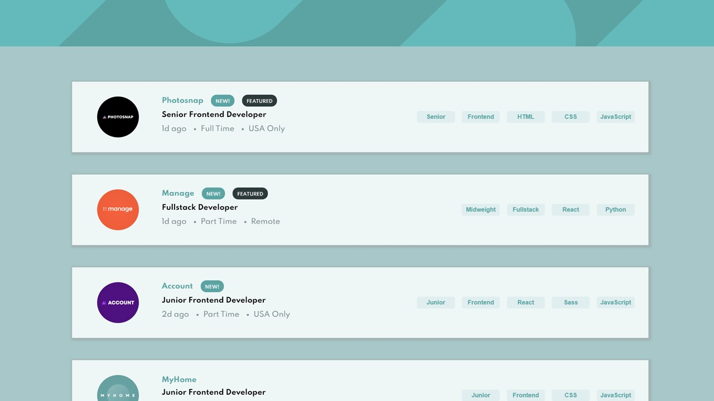
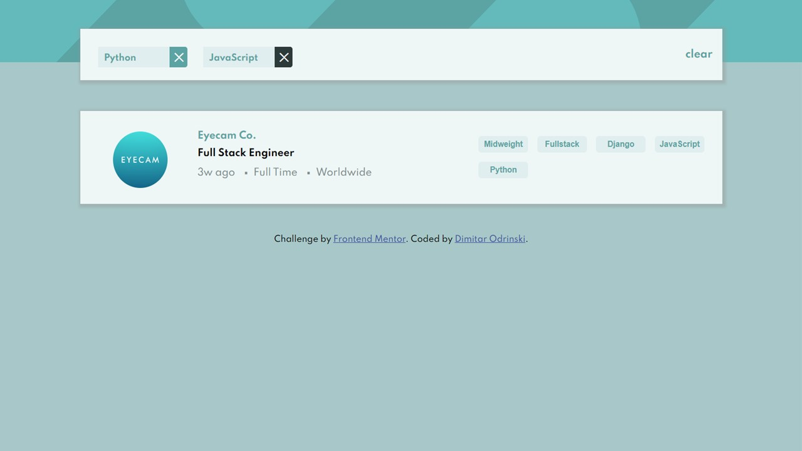
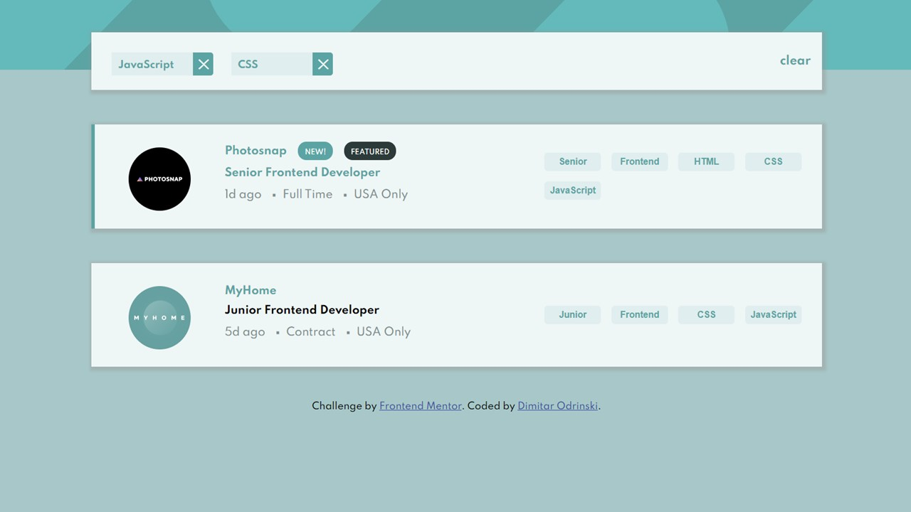
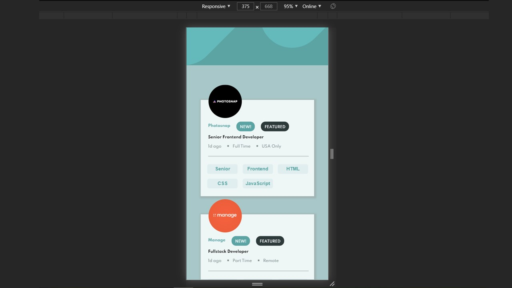
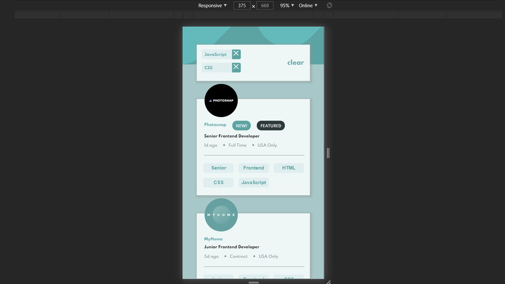

# Frontend Mentor - Job Listings Challenge

## The challenge

Your challenge is to build out this job listing page and get it looking as close to the design as possible.

You can use any tools you like to help you complete the challenge. So if you've got something you'd like to practice, feel free to give it a go.

Your users should be able to:

- View the optimal layout for the site depending on their device's screen size
- See hover states for all interactive elements on the page
- Filter job listings based on the categories

### My Solution - Option 2

Use the [data.json](./data.json) file to pull the data and then dynamically add the content. This has been achieved by Vanilla JS only (no frameworks).
## Here are some previews of the final page

## Desktop view
Desktop view without search bar:

Desktop view with search bar:

Desktop view with hover on button:

Desktop view with hover on position:

## Mobile view

Mobile view without search bar:

Mobile view with search bar:

## Challenge specification

The design is to be created to the following widths:

- Mobile: 375px
- Desktop: 1440px
